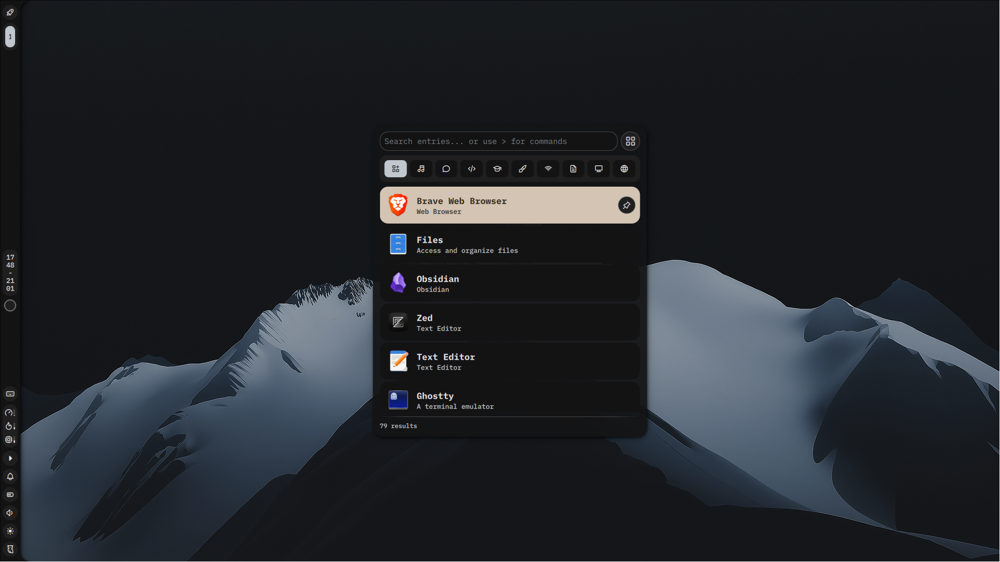
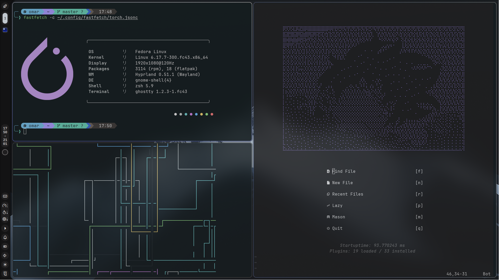

# Senpai Dots ✨

*Full Fedora & Hyprland rice*





---
## Table of Contents
- [Specs](#specs)
- [Software](#software)
- [Installation](#installation)

---

## Specs 

| Component       | Choice                                                       |
| --------------- | ------------------------------------------------------------ |
| OS              | Fedora 43 (Workstation Edition)                              |
| WM / Compositor | Hyprland                                                     |
| Shell           | zsh + starship                                               |
| Terminal        | kitty                                                        |
| Panel / Bar     | waybar                                                       |
| Launcher        | wofi                                                         |
| Notifications   | noctalia-shell                                               |
| DE Shell        | noctalia-shell                                               |
| File Manager    | nautilus                                                     |
| Editor          | neovim (lazy.nvim) + zed (customized)                        |
| Browser         | Brave                                                        |
| Note-taking     | Obsidian                                                     |
| GTK Theme       | Colloid-gtk                                                  |
| Icon Theme      | MoreWaita                                                    |
| Font            | JetBrainsMono Nerd Font + Iosevka + Inter + SFMono Nerd Font |

---

## Software

### Core
- `hyprland` + `waypaper`
- `waybar` (with custom modules)
- `wofi`
- `swaybg` (wallpaper daemon)
- `DankMaterialShell` (aka dms )

### Theming & Looks
- `qt5ct` + `qt6ct` (for Qt apps)
- `colloid-gtk` + `MoreWaita-icon-theme`

### Productivity & Ricing goodies
- `starship` prompt
- `exa` + `bpytop`
- `cava` (visualizer)


> [!warning]
> The repo is tailor-made for guiding Fedora users, if you're using another distro, make sure to check the packages are available for your distro and install them
> 
> Clone the repo locally on your system and explore the configs depending on what would you specifically need


---
## Installation

Clone and run the install script:

```bash
git clone https://github.com/S9npai/dotfiles.git
cd ~/Dotfiles/Code/Dots && ./install.sh
```
